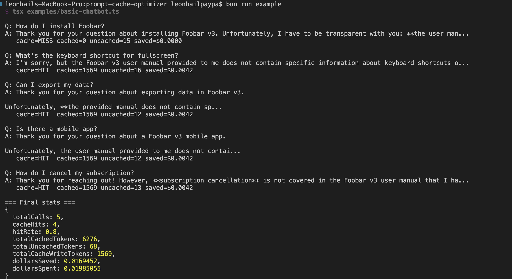

# prompt-cache-optimizer

[](https://www.npmjs.com/package/prompt-cache-optimizer)
[](https://www.npmjs.com/package/prompt-cache-optimizer)
[](https://github.com/leonhail-nell/prompt-cache-optimizer/actions/workflows/ci.yml)
[](LICENSE)
[](tsconfig.json)

Drop-in wrapper for the Anthropic SDK that makes prompt caching effortless. Places `cache_control` breakpoints, measures real cache hit rate from the response usage object, and warns when your cache silently breaks.



> Real output from `bun run example` — 5 calls, 80% hit rate, $0.017 saved on $0.020 spent. Same workload without caching would have cost $0.037 (~46% more).

> Status: v0.1 — measurement and explicit helpers. Auto-placement lands in v0.2.

## Why this exists

Anthropic prompt caching gives you a 90% discount on the cached portion of your prompt. But the API is finicky:

- A misplaced `cache_control` breakpoint silently degrades to a full-price call
- You only get 4 breakpoints per request — they have to be spent well
- Cache prefixes break if message order shifts even slightly
- The default TTL is 5 minutes; lots of setups silently regress when calls come in slower than that
- The only way to know it's working is to parse `cache_read_input_tokens` yourself

`prompt-cache-optimizer` handles all of that for you.

## Install

```bash
npm install prompt-cache-optimizer @anthropic-ai/sdk
# or
bun add prompt-cache-optimizer @anthropic-ai/sdk
```

## Quick start

```ts
import { CachedAnthropic } from "prompt-cache-optimizer";

const client = new CachedAnthropic({
  apiKey: process.env.ANTHROPIC_API_KEY!,
  warnIfHitRateBelow: 0.6,
});

const response = await client.messages.create({
  model: "claude-sonnet-4-6",
  max_tokens: 1024,
  system: longSystemPrompt,
  messages: conversation,
});

console.log(response.cacheInfo);
// { hit: true, cachedTokens: 8420, uncachedTokens: 312, dollarsSaved: 0.024, ... }

console.log(client.stats());
// { totalCalls: 1, hitRate: 1, totalCachedTokens: 8420, dollarsSaved: 0.024, ... }
```

## Manual breakpoint placement

For v0.1, breakpoint placement is opt-in via the `placeBreakpoints` helper:

```ts
import { placeBreakpoints } from "prompt-cache-optimizer";

const { system, messages } = placeBreakpoints({
  system: longSystemPrompt,
  messages: conversation,
  strategy: "after-system",
});

await client.messages.create({ model, max_tokens, system, messages });
```

Three strategies are available:

- `after-system` — cache the system prompt (best for RAG and long instructions)
- `after-last-assistant` — cache the conversation history (best for chat)
- `system-and-history` — cache both (uses 2 of your 4 breakpoints)

## Stats

```ts
client.stats();
// {
//   totalCalls: 142,
//   cacheHits: 124,
//   hitRate: 0.873,
//   totalCachedTokens: 1_240_000,
//   totalUncachedTokens: 52_400,
//   totalCacheWriteTokens: 21_000,
//   dollarsSaved: 3.72,
//   dollarsSpent: 1.41,
// }
```

## Warnings

The client emits passive warnings (never throws, never blocks a request):

- `no-cache-control-found` — you forgot to mark anything cacheable
- `cache-write-without-read` — your prefix changed call-over-call; cache is broken
- `low-hit-rate` — rolling hit rate fell below your threshold
- `unknown-model` — pricing unknown, so dollar accounting is skipped

Route them anywhere:

```ts
new CachedAnthropic({
  apiKey,
  onWarning: (event) => logger.warn(event),
});
```

## Roadmap

- **v0.2** — auto-placement of `cache_control` breakpoints based on observed prompt stability
- **v0.3** — safe message and tool reordering to maximize the stable prefix
- **v0.4** — OpenAI and Gemini prompt caching support
- **v1.0** — persistent stats adapter, middleware mode

## Zero runtime dependencies

`@anthropic-ai/sdk` is a peer dependency. `prompt-cache-optimizer` itself has zero runtime deps. The unpacked install is under 50 KB.

## Contributing

PRs welcome — see [CONTRIBUTING.md](CONTRIBUTING.md).

## Support this project

If this package saved you money on your Anthropic bill, consider buying me a coffee. This project is MIT-licensed and free forever; sponsorship just helps me spend more time on it.

<a href="https://buymeacoffee.com/leonhail" target="_blank"></a>

[](https://github.com/sponsors/leonhail-nell)

## License

[MIT](LICENSE) © Leonhail Paypa

---

⭐ **If this package saved you money on your Anthropic bill, please star the repo.** It's the single biggest signal that helps other developers find it.
